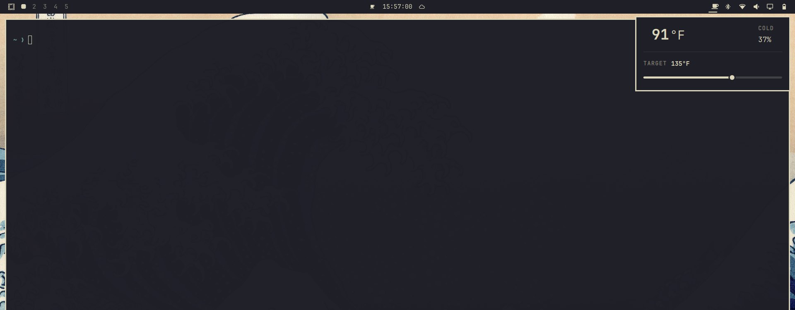
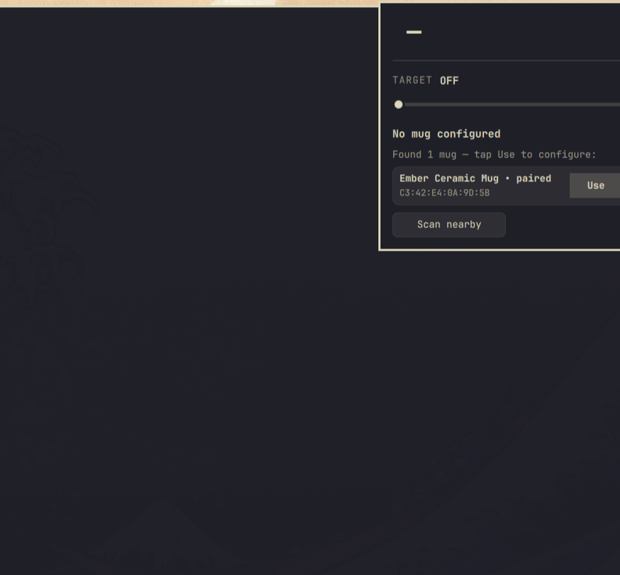

# Ember-Tray



Control your Ember smart mug from the Omarchy tray — see temperature and battery, set the target.

## Install

```sh
omarchy plugin add https://github.com/Confined-/Ember-Tray.git --enable
```

## Pair

Pair via the Bluetooth tray icon, or via this panel: tap **Scan nearby** to discover the mug, then tap **Use** — it pairs automatically.

> **First pairing:** The mug must be in pairing mode. If it was ever paired to a phone or another PC, reset it first: pick it up, hold the bottom button ~15 s until it blinks blue → yellow → red, let go, wait for white pulse. Then hold the button ~3 s until it pulses blue — pulsing blue means it’s in pairing mode and discoverable. Then hit **Scan nearby**.

Open the tray panel after pairing:

- One paired mug → connects automatically.
- Several mugs → tap **Use** on the one you want.

If the phone app is connected, disconnect it first.

If the mug still won’t appear after reset, forget *Ember Ceramic Mug* in Bluetooth settings, put the mug back into pairing mode (hold ~3 s → blue pulse) and try **Scan nearby** again — [official instructions](https://support.ember.com/en-US/ember-mug-how-to-reset-1757480).

**Pairing via the panel:**

1. With no mug configured, open the panel — tap **Scan nearby** if nothing appears.

   

2. Tap **Pair** (or **Use** if already paired) on the found mug — it connects and shows the temperature.

## Use

- Click the tray icon to open the panel.
- Tap the large temperature to switch °F/°C.
- Drag the slider to set the target — far left is **Off**.

No config files to edit. A freshly paired mug is kept off until you pick a temperature (it would otherwise default to ~135 °F).

## Configure

No settings UI is provided — this is intentional. The widget is configured either automatically (open the panel → **Use**/**Pair**) or by editing `~/.config/omarchy/shell.json` (`bar.layout.*` → `confined-.ember` → `mac`/`unit`/`pollIntervalSec`). The `barWidget.defaults`/`schema` in `manifest.json` documents the keys but is not validated by the current Omarchy shell.

Requires **Omarchy 4 (Quattro) shell**, **BlueZ**, and **python-dbus** (`dbus-python`). Tested on Ember Mug 2 with firmware 2.x — other models may vary (protocol by [orlopau/ember-mug](https://github.com/orlopau/ember-mug)).

## Remove

```sh
omarchy plugin remove confined-.ember
```

## License

MIT — see [LICENSE](LICENSE).
